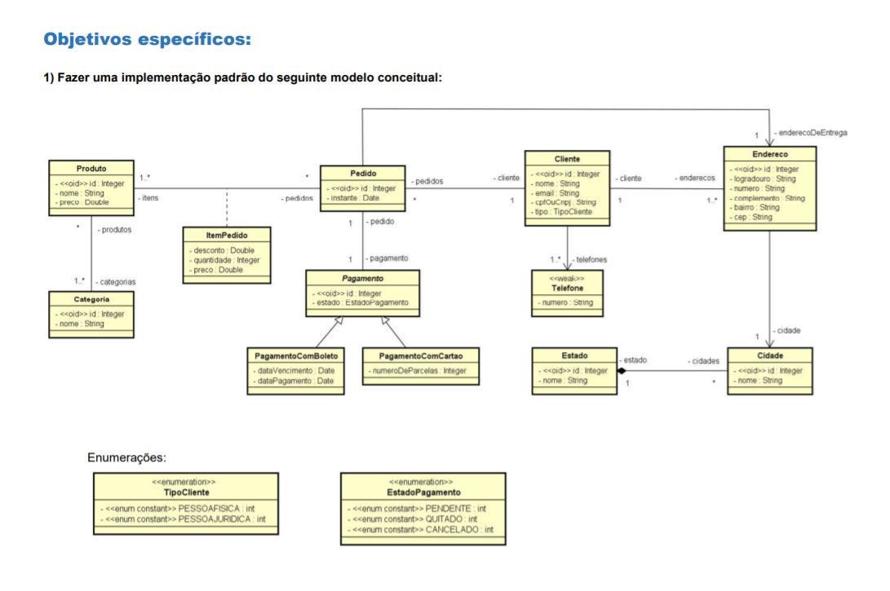
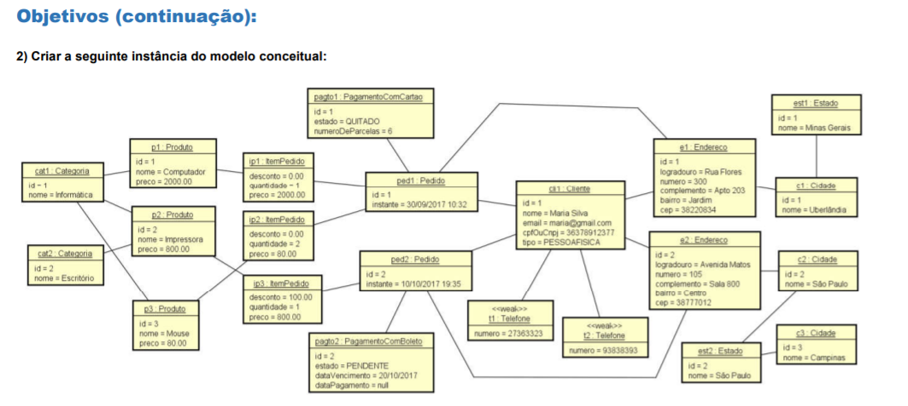

# cursomc

Repositório para o estudo de caso do curso - Udemy sobre UML (Unified Modeling Language)

Uso da plataforma Java, com Spring Boot e JPA. Implementação do modelo completo, com criação de uma instância do modelo em Java, e geração da base de dados relacional automaticamente. Por fim, são disponibilizados endpoints REST para recuperar e apresentar os dados em formato JSON.

Neste projeto são utilizadas:

    Leitura e entendimento do diagrama de classes
    Leitura e entendimento do diagrama de objetos
    Associações
    Um para muitos / muitos para um
    Um para um
    Muitos para muitos
    Conceito dependente
    Classe de associação
    Herança
    Enumerações
    Tipos primitivos (ItemPedidoPK)
    Entidades fracas (ElementCollection)
    Associações direcionadas
    

